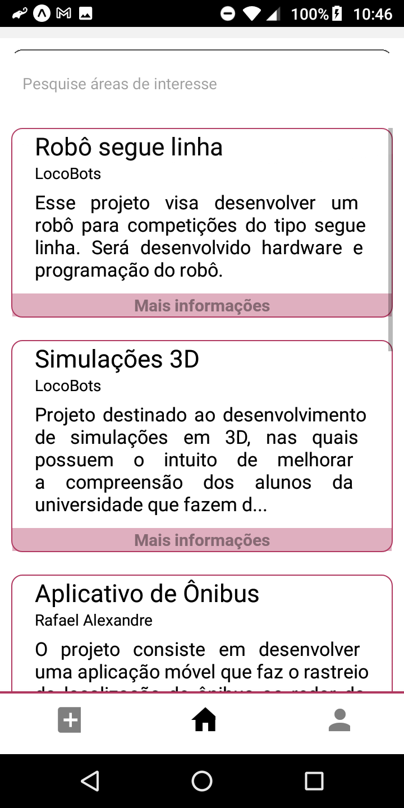
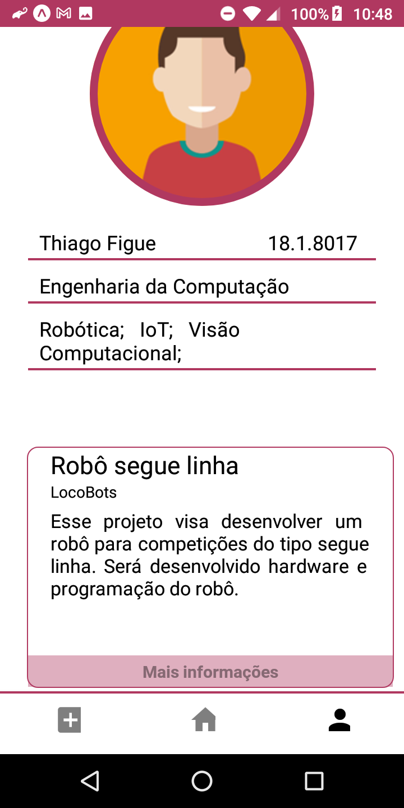
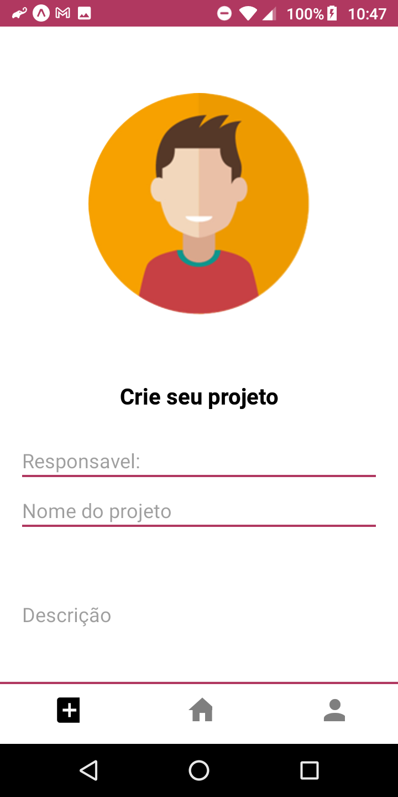
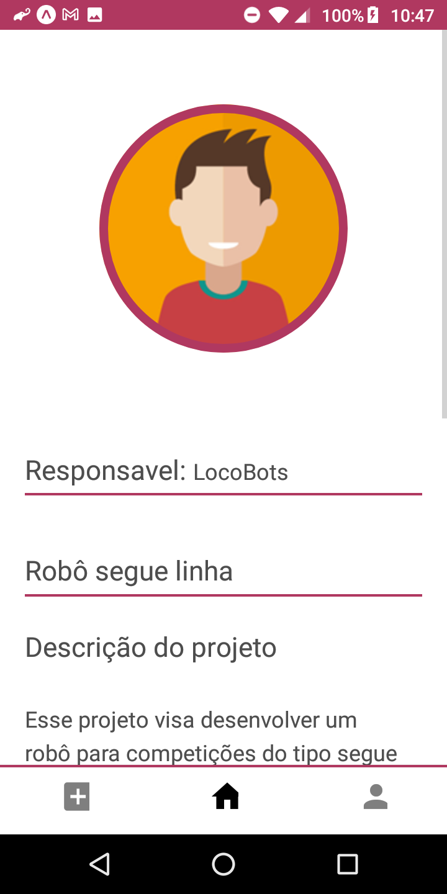

#  PINÇA.ME - Pense no futuro, pince suas escolhas

<div align="center" style="margin-top:40px;margin-bottom:40px">
  
  [](https://github.com/JJader/projects/) [](https://github.com/JJader/projects/) [](https://github.com/JJader/projects/) [](https://github.com/JJader/projects/issues) [](https://github.com/JJader/projects/pulls)

</div>

<div style="display:flex;flex:1;flex-direction:column;justify-content=center">

  <div align="center" style="width:100%">
    
    
    
  </div>

  <div align="center" style="width:100%">
    
    
  <div>

</div>

<div align="left" style="text-align:justify; margin-top:40px" >

<br>

Suas experiências são muito importante para o mercado de trabalho. Portanto, nada melhor para adquirir experiência durante a graduação do que a participação em projetos. Porém, qual projeto escolher? Onde encontrar? Quais pessoas estão envolvidas nos trabalhos? 🤔

<p align="center">Com o Pinça.me a busca por oportunidades se tornará algo simples</p> 

O Pinça.me é uma aplicação móvel que ajudará a reunir idealizadores e colaboradores em um único ambiente, democratizando o acesso a projetos.

Espera-se que, ao reunir diversos projetos - sejam eles: iniciação científica, projetos de extensão, núcleo de atividades, empresas juniores, laboratórios e até mesmo projetos pessoais - ocorra um maior engajamento entre universitários e atividades extracurriculares. E o melhor: evitando a confusão gerada pelas maneiras tradicionais de divulgar ou encontrar iniciativas dentro da universidade.

> Tudo isso, na era IoT, possibilita o levantamento dos principais pontos de pesquisa em determinadas áreas. Com sistema inteligente garantiremos que você encontre os melhores parceiros. 😉 

<br>
<hr/>

## ⚙️ Funcionalidades

Desenvolvido no Hackathon da [SEnC](https://senc.icmc.usp.br/hackathon/) com o Pinça.me você será capaz de:

  - [x] Ter um perfil com todos os trabalhos que você realiza/realizou;

  - [x] Ter acesso ao Feed de projetos desenvolvidos na universidade, com informações sobre o responsável pelo projeto, a área de atuação, valor da bolsa e várias outras;
  
  - [x] Notificações de novas oportunidades de acordo com suas áreas de interesse;
  
  - [x] Buscar colaboradores e parceiros para seus projetos, sejam eles acadêmicos ou pessoais.

## 🛠️ Construído com

* Front end 
  * [Figma](https://www.figma.com/) - Ferramenta de prototipagem;
  * [React native](https://reactnative.dev/) - Framework;

* Back end
  * [Node.js](https://nodejs.org/en/) - Ambiente de execução JS;
  * [Express.js](https://expressjs.com/pt-br/) - Framework;
  * [Mongodb](https://www.mongodb.com/) - Banco de dados.

## 📋 Pré-requisitos

Para executar o aplicativo você precisará:

  - Node
  - Expo CLI

Para isso basta seguir a documentação do React Native [nesse link](https://reactnative.dev/docs/environment-setup) na aba Expo CLI Quickstart. 😉

Alem disso:
  - Ter o app da expo instalado em seu celular android, [clique aqui](https://play.google.com/store/apps/details?id=host.exp.exponent&hl=pt_BR);
  - Ter o nosso repositório baixado em sua máquina, [clique aqui](https://github.com/JJader/Siot/archive/master.zip).

## 🔧 Instalação do projeto na máquina local

Após fazer o download do repositório, entre do diretório da pasta e execute o seguinte comando:

```bash
npm install

expo start
```

Isso gerará um qrCode que pode ser lido pelo aplicativo da expo.

Para Executar o back end (ainda não implementado no front end) basta entrar na pasta backEnd e executar: 

```bash
npm install

npm start
```

## 🧡 Autores

* [Alexsander do Vale](https://www.instagram.com/marx_al172/) - *UI/UE*
* [Jamisson Jader](https://www.instagram.com/jjader03/?hl=pt-br) - *Desenvolvedor*
* [Lucas Novais](https://www.instagram.com/l.novais_s/?hl=pt-br) - *Negócios* 
* [Pedro Lucas](https://www.instagram.com/tukspl/?hl=pt-br) - *Desenvolvedor* 
* [Thiago Silva](https://www.linkedin.com/in/thiago-silva-de-figueiredo-658bb965/) - *Negócios*

</div>
